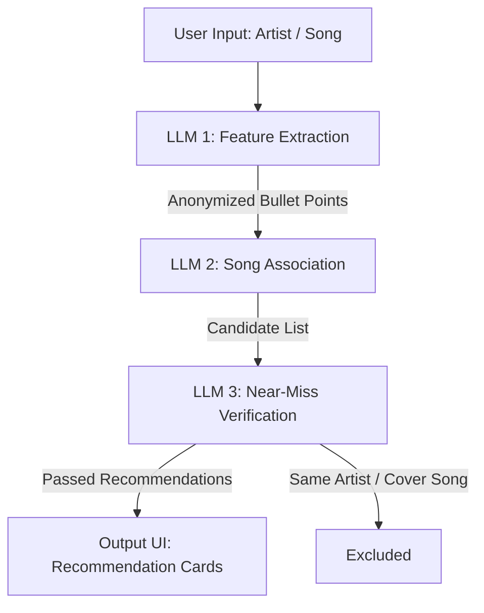

# AnonMusicRec 🎵

[日本語の案内は英語の後にあります / Japanese instructions follow the English section]

AnonMusicRec is a privacy-conscious, feature-based music recommendation web application powered by **Google Cloud Vertex AI** (Gemini 2.5 Flash / Pro).

Instead of matching generic metadata or using basic collaborative filtering, AnonMusicRec leverages a multi-stage LLM pipeline to analyze the core "musical characteristics" of your favorite songs and artists, strip away all identifying proper nouns, and associate them with new tracks while ensuring zero overlap with the original artist or song.

---

## Features 🚀

- **3-Stage LLM Pipeline**:
  1. **Feature Extraction**: Extracts detailed musical features (tempo, rhythm, instruments, vocals, lyrical themes) while strictly censoring proper nouns (artist, song title, etc.) and selected filters.
  2. **Song Association**: Suggests real, existing songs matching the anonymized description.
  3. **Near-Miss Verification**: Performs semantic filtering to ensure recommended items do not overlap with the user's input (such as cover songs or different songs by the same artist).
- **Anonymize & Emphasize Filters**:
  - Hide or emphasize specific musical aspects: Vocal Gender/Timbre, Members/Format, Genre, Era/Period, Country/Language, and Lyrical Themes.
  - Controls are mutually exclusive (e.g., you cannot hide and emphasize "Genre" simultaneously).
- **Google Search Integration**: Grounding feature to fetch up-to-date and highly accurate musical analysis.
- **Bilingual Interface**: Seamlessly toggle between **English** and **日本語** (Japanese).
- **Vertex AI Integration**: Secured proxy-server architecture that avoids exposing API keys on the frontend by using local Google Cloud credentials.

---

## 3-Stage LLM Pipeline Architecture 🛠️



---

## Setup & Running Locally 💻

### Prerequisites
- Node.js (v18+)
- Google Cloud CLI (`gcloud`) installed and authenticated.

### 1. Authenticate with Google Cloud
The backend proxy server utilizes Google Application Default Credentials (ADC). Run the following command in your terminal to set up credentials locally:
```bash
gcloud auth application-default login
```
*Make sure your active Google Cloud project has the Vertex AI API enabled.*

### 2. Install Dependencies
```bash
npm install
```

### 3. Start the Backend Proxy Server
```bash
node server.js
```
The server runs on port `3001` and connects to Vertex AI.

### 4. Start the Frontend Dev Server
In a separate terminal window:
```bash
npm run dev
```
Open `http://localhost:5173` in your browser to use the application.

---

# 日本語

AnonMusicRecは、**Google Cloud Vertex AI** (Gemini 2.5 Flash / Pro) を活用した、音楽の特徴量に基づくプライバシー配慮型の音楽推薦ウェブアプリケーションです。

一般的なメタデータマッチングや協調フィルタリングとは異なり、3段階のLLM（大規模言語モデル）パイプラインを利用して、ユーザーの好きな曲や歌手の「本質的な音楽的特徴」を抽出し、固有名詞を完全に排除した上で類似曲を連想・推薦します。元のアーティスト名や曲そのものが推薦結果に含まれないよう徹底した除外フィルタリングを行います。

---

## 特徴 🚀

- **3段階のLLMパイプライン**:
  1. **特徴抽出プロファイリング**: 固有名詞や指定されたフィルター項目を隠蔽しながら、テンポ、使用楽器、歌声、歌詞のテーマなどの特徴を箇条書きで抽出。
  2. **特徴からの曲の連想**: 抽出された特徴（記述）のみを頼りに、実在する類似曲をLLMが連想。
  3. **ニアミス検証 & 正解除外**: 推測された曲が、元の曲名・アーティストと被っていないか（カバー曲や同アーティストの別曲でないか）をセマンティックに検証し除外。
- **匿名化（隠す）＆強調設定**:
  - ボーカルの性別、人数/構成、ジャンル、年代/時期、国籍/言語、歌詞内容の6項目について、個別に「隠す」か「強調する」かを制御可能（※「隠す」と「強調」は排他制御されます）。
- **Google 検索連携**: Google検索ツールを活用し、最新かつ正確な音楽的プロファイリングを取得可能。
- **マルチリンガル対応**: UIおよびプロンプト言語を **日本語** と **英語** でワンクリック切り替え可能。
- **Vertex AI 連携**: フロントエンドにAPIキーを露出させないExpressプロキシサーバー構成。ローカルの認証情報（ADC）を利用して安全に動作します。

---

## 開発環境のセットアップ 💻

### 前提条件
- Node.js (v18以降)
- Google Cloud CLI (`gcloud`) のインストールおよびセットアップ

### 1. Google Cloud 認証のセットアップ
バックエンドサーバーはGoogleの「アプリケーションのデフォルト認証情報 (ADC)」を使用します。ターミナルで以下を実行し、認証を行ってください。
```bash
gcloud auth application-default login
```
*※使用するGCPプロジェクトで Vertex AI API が有効化されていることを確認してください。*

### 2. 依存関係のインストール
```bash
npm install
```

### 3. バックエンドプロキシサーバーの起動
```bash
node server.js
```
サーバーがポート `3001` で起動し、Vertex AIへの通信を仲介します。

### 4. フロントエンド開発サーバーの起動
別のターミナルウィンドウで以下を実行します：
```bash
npm run dev
```
ブラウザで `http://localhost:5173` を開くとアプリを利用できます。
